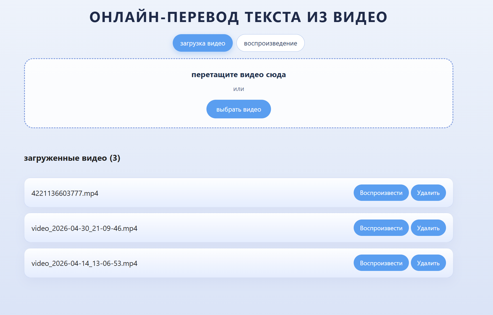
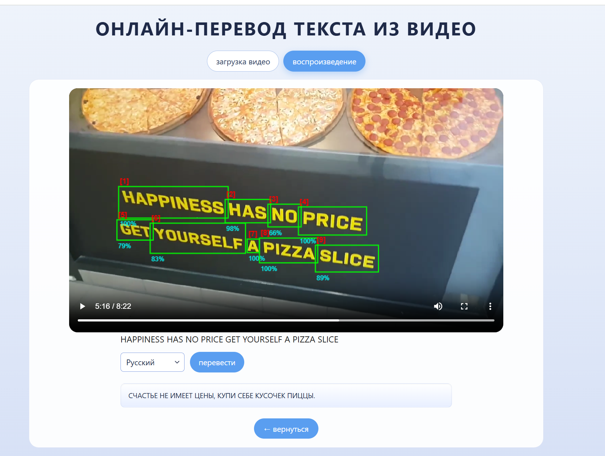

# Video OCR & Translation

Проект представляет собой веб-приложение для извлечения, распознавания и перевода текста с видеокадра. Приложения работает с помощью дообученной ИИ-модели EasyOCR.
<div style="text-align:center;">
  
  <br/><br/>
  
</div>

## Структура проекта

- `backend/main.py` — FastAPI сервер для:
  - распознавания текста на кадрах (`/ocr`)
  - перевода текста через Yandex Translate (`/translate`)
  - обслуживания фронтенда и статических файлов

- `backend/user_network/` — файлы для работы дообученной модели
- `backend/model/` — модели EasyOCR (craft и latin)

- `frontend/js/app.js` — логика загрузки видео, управления плеером, OCR и переводом
- `frontend/css/styles.css` — стили интерфейса

- `ml_notebooks/` — ноутбуки для подготовки данных, обучения, исследования метрик
- `ml_notebooks/my_finetune.yaml` — конфигурация дообучения

```text
Project/
├── backend/
│   ├── main.py
│   ├── requirements.txt
│   ├── user_network/
│   └── model/
├── frontend/
│   ├── index.html
│   ├── css/
│   │   └── styles.css
│   └── js/
│       └── app.js
├── ml_notebooks/
│   ├── dataset-preparation.ipynb
│   ├── eval-metrics.ipynb
│   └── my_finetune.yaml
└── README.md
```
## Основные возможности

- загрузка видео через drag-and-drop или файл-диалог
- воспроизведение загруженных видео
- остановка видео на кадре и отправка кадра на OCR
- отображение рамок распознанного текста на видео
- перевод распознанного текста на выбранный язык

## Установка и запуск

### 1. Клонируйте репозиторий

```powershell
git clone https://github.com/meowbeback/VideoPlayerProject.git
```

### 2. Создайте виртуальное окружение и установите зависимости

```powershell
cd backend
python3 -m venv venv
.\venv\Scripts\Activate.ps1 (Windows)
source venv/bin/activate (Linux)
pip install -r requirements.txt
```

### 3. Настройте переменные окружения

Для работы перевода нужно указать `YANDEX_API_KEY` и `YANDEX_FOLDER_ID`.

```powershell
$env:YANDEX_API_KEY = "your_api_key"
$env:YANDEX_FOLDER_ID = "your_folder_id"
```

### 4. Запустите сервер

```powershell
uvicorn backend.main:app --reload --host 0.0.0.0 --port 8000
```

### 5. Откройте приложение

В браузере перейдите:

```
http://localhost:8000
```

## Model & Dataset (Kaggle)

- Dataset: https://www.kaggle.com/datasets/evgeniyashpirnova/trainvaldataset

Скачивание через Kaggle CLI:

1. Установите kaggle CLI, если нужно  
```powershell
pip install kaggle
```  

2. Поместите kaggle.json (API token) в %USERPROFILE%\\.kaggle\\kaggle.json или экспортируйте переменные окружения  
Скачать и распаковать датасет в backend/model  

```powershell
kaggle datasets download -d evgeniyashpirnova/trainvaldataset -p backend/model --unzip  
kaggle models download -m evgeniyashpirnova/latin-g2-finetuned -p backend/model --unzip
```  

## Как использовать

1. Загрузите видео на вкладке `загрузка видео`.
2. Выберите видео и нажмите `Воспроизвести`.
3. Остановите видео на нужном кадре.
4. Приложение отправит кадр на `/ocr` и получит распознанный текст.
5. Нажмите `Перевести текст` или выберите язык и перевод автоматически выполнится.
